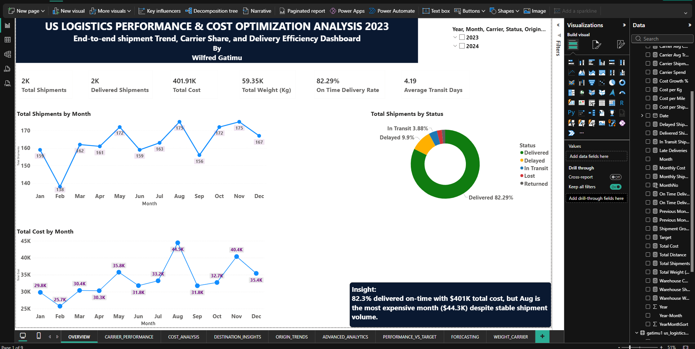
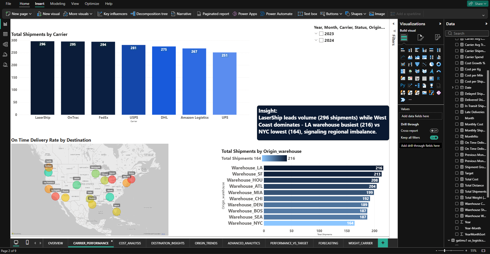
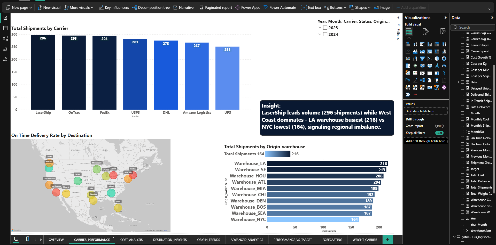
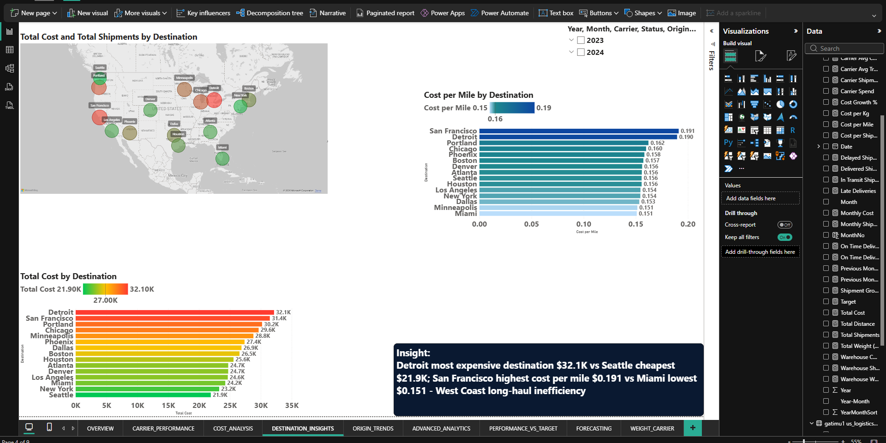
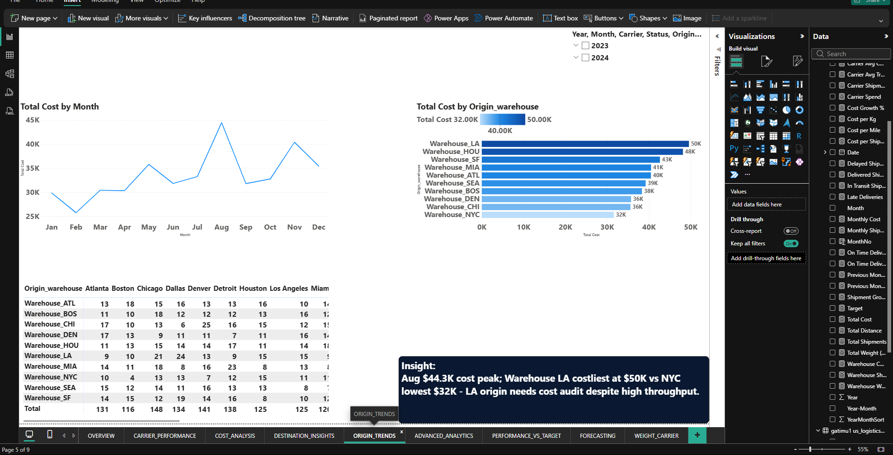
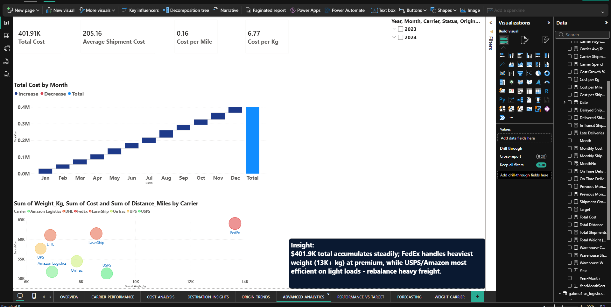
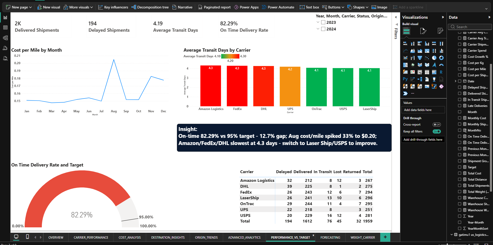
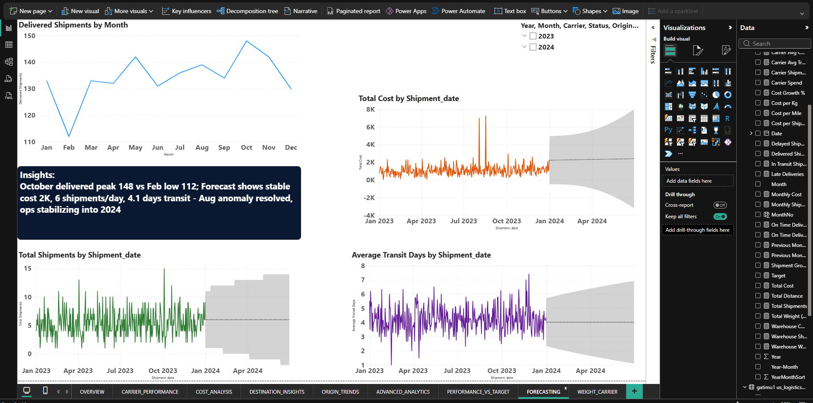
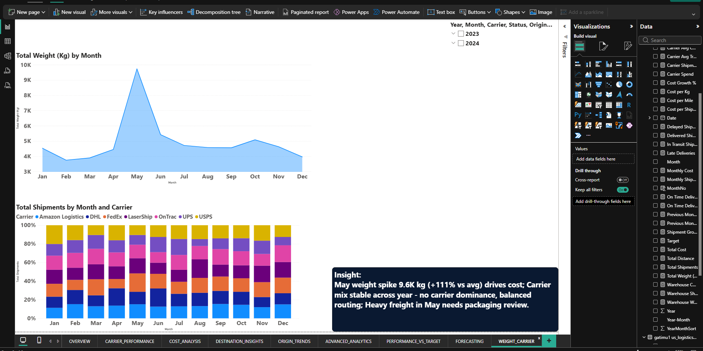

# US Logistics Performance & Cost Optimization | Power BI Dashboard

**Analyzing $401.9K Spend | 1,806 Shipments | 9 Pages | Built in Nairobi, KE**
`Power BI | DAX | Forecasting | Supply Chain Analytics`

### 📸 Live Preview

### 🔍 Key Business Findings
- **August Cost Anomaly:** Spend spiked to $44.3K, cost/mile $0.20 (+33% vs avg) - carrier rate renegotiation needed
- **OTD Risk:** 82.29% On-Time Delivery vs 95% target = 12.7% gap, impacts customer SLA
- **Weight Surge:** May weight 9.6K kg (+111% MoM) - warehouse capacity risk flagged
- **Route Inefficiency:** Detroit origin $32.1K highest cost, Seattle $21.9K most efficient
- **Carrier Winner:** LaserShip / USPS fastest 4.1 days avg, DHL slowest - optimization opportunity
  
  
  

  

  

  

  

  

  
### 📑 Dashboard Pages
1. **OVERVIEW** - KPIs: $401K cost, 1.8K shipments, 59K kg, OTD%
2. **CARRIER_PERFORMANCE** - Carrier share, avg delivery time
3. **COST_ANALYSIS** - Cost by month, cost per mile trends
4. **DESTINATION_INSIGHTS** - Cost by destination map, delivery rate
5. **ORIGIN_TRENDS** - Top origins Detroit, Chicago analysis
6. **ADVANCED_ANALYTICS** - Key Influencers, Decomposition Tree
7. **PERFORMANCE_VS_TARGET** - OTD vs 95% target tracking
8. **FORECASTING** - 3-month cost & volume forecast
9. **WEIGHT_CARRIER_MIX** - Weight vs carrier cost correlation

### 🛠️ Tech Stack
- Power BI Desktop, DAX Measures, Power Query, Forecasting, What-If Analysis
- Data Cleaning, Storytelling, Executive KPIs

### 📁 Files
- `Us Logistics.pbix` - Full interactive dashboard (download to explore)
- `Us_Logistics_*.png` - 9 high-res screenshots

### 🚀 How to View
1. Download `Us Logistics.pbix`
2. Open in Power BI Desktop (free)
3. Interact with slicers & forecasts

---
**Author:** Wilfred Gatimu - Data Analyst | Logistics & Telco Analytics
[LinkedIn] | Nairobi, Kenya 2026
